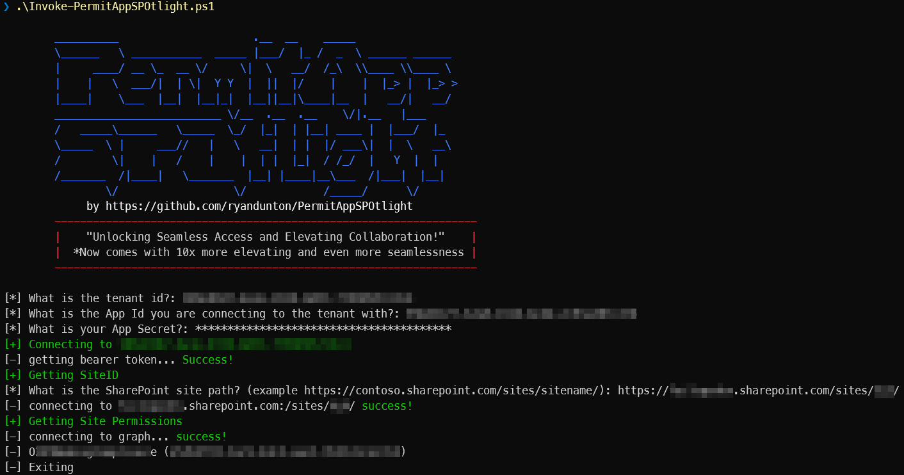
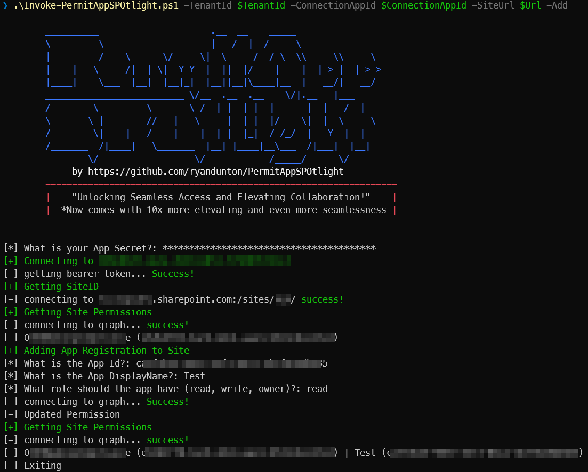
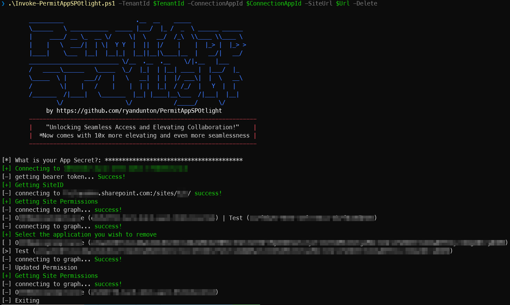

# PermitAppSPOtlight
Add and Remove Entra ID App Registration permissions to a SharePoint site collection using Graph API

## Description
This script is designed to manage the permissions of an App Registration on a SharePoint Online site collection. It uses the Microsoft Graph API to add or delete  permissions. The script requires an OAuth2 token for authentication and the URL of the SharePoint site. It retrieves the site ID and updates the permissions accordingly.
## Usage
```
# Check site for existing app permissions on a site
PS C:\> .\Invoke-PermitAppSPOtlight.ps1

# Check site for existing app permissions and provide everything in pipeline
# Note: -ConnectionSecret expects a SecureString
PS C:\> .\Invoke-PermitAppSPOtlight.ps1 -TenantId "c93d1a61-8c45-44f1-9484-205ce56e7ac4" `
                                        -ConnectionAppId "9e941cb1-4832-4231-a867-a9321171ca7f" `
                                        -ConnectionSecret $Secret `
                                        -SiteUrl "https://contosodev.sharepoint.com/sites/sitecollection/"

# Give an app registration permissions to a site and provide everything in pipeline
PS C:\> .\Invoke-PermitAppSPOtlight.ps1 -TenantId "c93d1a61-8c45-44f1-9484-205ce56e7ac4" `
                                        -ConnectionAppId "9e941cb1-4832-4231-a867-a9321171ca7f" `
                                        -SiteUrl "https://contosodev.sharepoint.com/sites/sitecollection/" `
                                        -AppId '43390439-c4be-4a78-a6f6-b98cca90a181' `
                                        -DisplayName 'My App' `
                                        -Add

# Delete existing app permissions from a site
PS C:\> .\Invoke-PermitAppSPOtlight.ps1 -TenantId "c93d1a61-8c45-44f1-9484-205ce56e7ac4" `
                                        -ConnectionAppId "9e941cb1-4832-4231-a867-a9321171ca7f" `
                                        -SiteUrl "https://contoso.sharepoint.com/sites/sitecollection/" `
                                        -Delete
```


